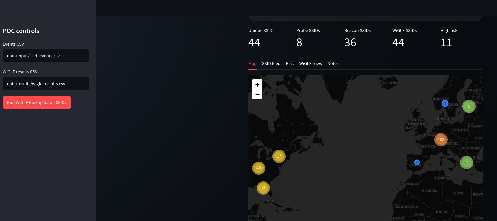
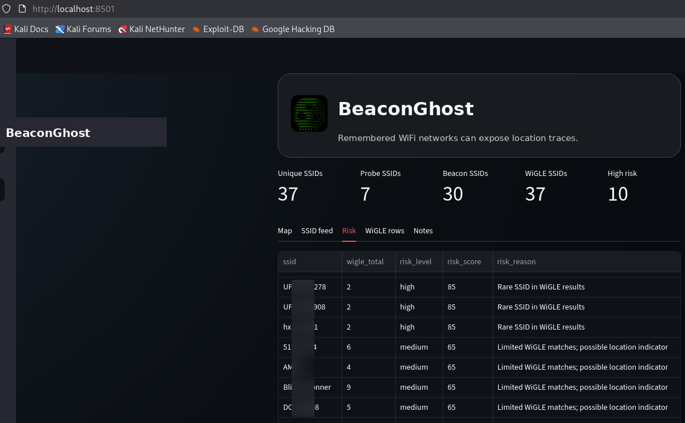

<p align="center">

</p>

<p align="center"><strong>BeaconGhost demonstrates how remembered WiFi networks can expose location traces when correlated with public WiFi geolocation data.</strong></p>


<p align="center">Created by <strong>M@infr@meMonkey</strong></p>

---

## Screenshots

<p align="center">
  
  
</p>

## What BeaconGhost does

BeaconGhost is a Kali Linux tool for passive SSID capture, WiGLE lookup, and Streamlit-based location-risk visualization.

It can collect SSIDs from probe requests, beacon frames, and existing PCAP/PCAPNG files. It then queries WiGLE for discovered SSIDs and visualizes possible location indicators on a dark dashboard map.

BeaconGhost is intentionally SSID-level only. It does not export client MAC addresses, does not export WiGLE BSSIDs/netids, does not capture credentials, does not perform deauthentication, does not create Evil Twin networks, and does not inject packets.

Use it only in your lab, on your own devices, or where you have permission to run passive wireless research.

## Repository layout

```text
BeaconGhost/
├── app.py                         Streamlit dashboard
├── beaconghost/                   Python modules
├── scripts/                       Kali capture and dashboard helpers
├── tools/                         PCAP import and CSV cleanup helpers
├── assets/                        Logo, avatar, favicon
├── docs/screenshots/              GitHub screenshots
├── data/                          Runtime output folders
├── setup.sh                       One-time setup and WiGLE credential prompt
├── run.sh                         Capture + WiGLE + dashboard launcher
├── dashboard.sh                   Dashboard-only launcher
└── .env.example                   Safe config template, no API keys
```

## Requirements

- Kali Linux
- USB WiFi adapter with monitor mode support, for example an ALFA adapter
- WiGLE API account and API token

## Quick start on Kali

```bash
cd ~/Desktop
git clone https://github.com/MainframeMonkey/BeaconGhost.git
cd BeaconGhost
chmod +x setup.sh run.sh dashboard.sh scripts/*.sh tools/*.py
./setup.sh
./run.sh
```

During `./setup.sh`, enter only:

```text
WiGLE API Name
WiGLE API Token
```

Everything else uses safe defaults:

```text
Interface: wlan0
Channel: 6
Capture duration: 60 seconds
Dashboard source filter: probe requests only
WiGLE lookup scope: probe requests only
Events CSV: data/input/ssid_events.csv
WiGLE results CSV: data/results/wigle_results.csv
```

Open the dashboard:

```text
http://localhost:8501
```

## Dashboard source filter

The sidebar contains an **SSID source filter**:

```text
Probe requests only      remembered networks searched by devices
Beacons only             nearby access points
All SSIDs                probe requests + beacons
```

The default is **Probe requests only**, so the map focuses on remembered-network traces rather than access points currently visible nearby.

## Manual `.env` setup

Instead of `./setup.sh`, you can edit `.env` manually:

```bash
cp .env.example .env
nano .env
chmod 600 .env
```

Set:

```text
WIGLE_API_NAME=your_api_name_here
WIGLE_API_TOKEN=your_api_token_here
```

Do not commit `.env`. It is ignored by Git.

## Common commands

Run default capture + WiGLE lookup + dashboard:

```bash
./run.sh
```

Run with explicit interface, duration, and channel:

```bash
./run.sh wlan0 60 6
```

Dashboard only:

```bash
./dashboard.sh
```

Preflight check:

```bash
bash scripts/01_preflight.sh wlan0
```

SSID debug:

```bash
sudo bash scripts/02_start_monitor.sh wlan0 6
bash scripts/08_debug_ssids.sh mon0 10
sudo bash scripts/04_stop_monitor.sh mon0
```

## PCAP/PCAPNG import

```bash
python tools/pcap_to_probe_ssids.py --pcap capture.pcapng --output data/input/ssid_events.csv
```

Include beacon frames too:

```bash
python tools/pcap_to_probe_ssids.py --pcap capture.pcapng --output data/input/ssid_events.csv --include-beacons
```

Normalize or decode an existing SSID CSV:

```bash
python tools/fix_ssids_csv.py old.csv data/input/ssid_events.csv
```

## Output files

```text
data/input/ssid_events.csv
data/results/wigle_results.csv
data/cache/wigle_cache.json
data/captures/tshark_fields_*.csv
data/debug/debug_*.csv
```

Generated runtime data is ignored by Git.

## WiGLE notes

BeaconGhost uses the WiGLE API credentials from `.env` and sends them as HTTP Basic authentication. If WiGLE returns HTTP 429, BeaconGhost writes partial/cache/skipped rows and the dashboard still starts.

Useful optional `.env` limits:

```text
WIGLE_FRAME_TYPE=probe_request
DASHBOARD_SOURCE_FILTER=probe_request
WIGLE_MAX_RESULTS_PER_SSID=10
WIGLE_SLEEP_SECONDS=2.0
WIGLE_MAX_NEW_LOOKUPS_PER_RUN=10
WIGLE_COORD_PRECISION=3
```

## GitHub push

```bash
git init
git add .
git commit -m "Initial BeaconGhost release"
git branch -M main
git remote add origin https://github.com/MainframeMonkey/BeaconGhost.git
git push -u origin main
```

## License

MIT License. See `LICENSE`.
